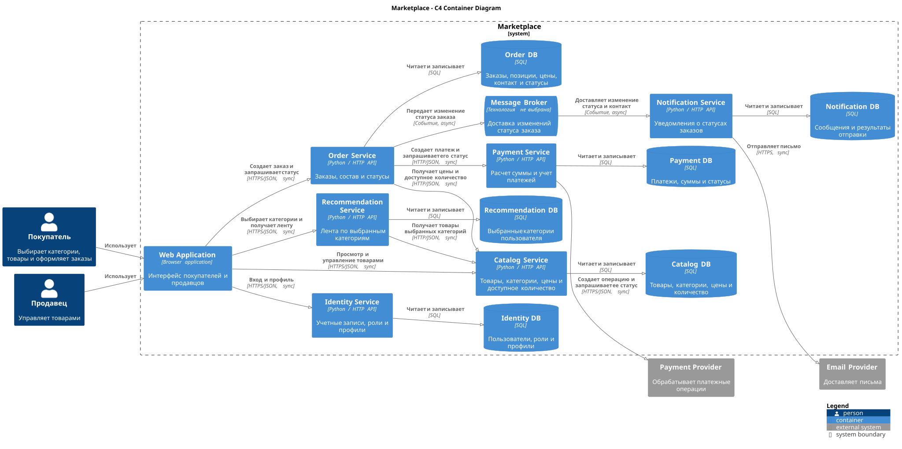

# Домашняя работа 1: архитектура маркетплейса

## 1. Цель и границы работы

Маркетплейс позволяет продавцам управлять товарами, а покупателям просматривать персональную ленту, оформлять и оплачивать заказы. Пользователи получают уведомления о статусах заказов.

Ниже описана целевая архитектура. В коде реализована только техническая заготовка Catalog Service с `GET /health`. Бизнес-логики нет; остальные сервисы, базы данных и брокер в Docker не запускаются.

## 2. Домены и ответственность

| Домен | Ответственность |
|---|---|
| Пользователи | Учетные записи, роли покупателя и продавца, профили |
| Каталог | Карточки товаров, категории, цены и доступное количество |
| Персональная лента | Подбор товаров по выбранным пользователем категориям |
| Заказы | Состав заказа, сумма и статусы заказа |
| Платежи | Расчет суммы к оплате по составу заказа, создание и учет платежей |
| Уведомления | Отправка сообщений о статусах заказов |

Персонализация простая: покупатель выбирает интересующие категории, а лента показывает доступные товары из этих категорий. Если категории не выбраны, показывается общий каталог.

## 3. Варианты разбиения

### Вариант A: Marketplace Core и отдельные вспомогательные сервисы

Marketplace Core объединяет пользователей, каталог и заказы в одном приложении с собственной базой данных. Лента, платежи и уведомления вынесены в отдельные сервисы со своими хранилищами.

Плюсы:

- меньше сетевых вызовов и договоренностей между сервисами;
- проще запускать и поддерживать систему;
- изменения каталога и заказа легче согласовать внутри одного приложения.

Минусы:

- пользователи, каталог и заказы выпускаются и масштабируются вместе;
- Core объединяет несколько бизнес-областей, поэтому со временем его сложнее изменять;
- изменение одного модуля требует проверки и выпуска всего Core.

### Вариант B: отдельный сервис для каждого домена

Пользователи, каталог, лента, заказы, платежи и уведомления выделены в шесть сервисов. Каждый сервис владеет своими данными.

Плюсы:

- у каждого сервиса одна понятная бизнес-ответственность;
- сервисы можно выпускать и масштабировать независимо;
- изменения внутри домена проще ограничить одним сервисом при сохранении его API-контракта.

Минусы:

- больше сетевых вызовов, каждый из которых может завершиться ошибкой;
- сложнее запуск, наблюдение за системой и поддержка контрактов;
- изменения заказа и платежа нужно согласовывать между отдельными сервисами.

## 4. Сравнение и финальный выбор

| Критерий | Вариант A | Вариант B |
|---|---|---|
| Простота эксплуатации | Меньше приложений, проще поддержка | Больше приложений, сложнее поддержка |
| Релизы пользователей, каталога и заказов | Общий релиз Core | Независимые релизы сервисов |
| Масштабирование каталога | Вместе с Core | Независимо от пользователей и заказов |
| Масштабирование ленты | Независимое | Независимое |
| Изоляция платежей | Отдельный сервис | Отдельный сервис |
| Согласование каталога и заказа | Внутри одного приложения | Через сетевые API |

Выбран **вариант B**: каждый сервис отвечает за отдельную бизнес-область и владеет своими данными.

В отличие от варианта A, каталог, пользователи и заказы можно обновлять и масштабировать независимо. Например, изменения в управлении товарами продавца можно выпускать отдельно от изменений в оформлении заказов, сохраняя совместимость API.

Цена такого разделения — больше сетевых вызовов, необходимость обрабатывать ошибки взаимодействия и более сложная эксплуатация. Вариант A проще в запуске и поддержке, но требует общего выпуска пользователей, каталога и заказов. В варианте B приоритет отдан независимому развитию этих областей.

## 5. Сервисы и владение данными

| Сервис | Ответственность | Собственные данные |
|---|---|---|
| Identity Service | Учетные записи, роли и профили | Пользователи, роли, профили |
| Catalog Service | Управление и чтение каталога | Товары, категории, цены, доступное количество |
| Recommendation Service | Выдача ленты по интересующим категориям | Выбранные категории пользователя |
| Order Service | Создание и просмотр заказов, изменение статусов | Заказы, позиции, зафиксированные цены, контакт для уведомлений и история статусов |
| Payment Service | Расчет суммы к оплате и учет платежа | Платежи, суммы, статусы и идентификаторы операций провайдера |
| Notification Service | Отправка уведомлений о заказах | Сообщения и результаты отправки |

У каждого сервиса собственная база данных. Другие сервисы получают его данные через API, а не читают таблицы напрямую.

Catalog Service хранит текущие цены товаров. Order Service сохраняет состав и цены на момент оформления заказа, чтобы изменение каталога не меняло уже созданный заказ. Payment Service рассчитывает сумму платежа по этим зафиксированным позициям.

В архитектуре предусмотрены сервисы на Python с HTTP API и реляционные базы данных (SQL).

## 6. Взаимодействия

| Источник | Получатель | Способ | Назначение |
|---|---|---|---|
| Web Application | Identity Service | Синхронно, HTTPS/JSON | Вход и управление профилем |
| Web Application | Catalog Service | Синхронно, HTTPS/JSON | Просмотр товаров и операции продавца |
| Web Application | Recommendation Service | Синхронно, HTTPS/JSON | Выбор категорий и получение ленты |
| Web Application | Order Service | Синхронно, HTTPS/JSON | Создание заказа и получение его статуса |
| Recommendation Service | Catalog Service | Синхронно, HTTP/JSON | Получение доступных товаров выбранных категорий |
| Order Service | Catalog Service | Синхронно, HTTP/JSON | Получение цен и доступного количества для заказа |
| Order Service | Payment Service | Синхронно, HTTP/JSON | Создание платежа и запрос его текущего статуса |
| Payment Service | Payment Provider | Синхронно, HTTPS/JSON | Создание платежной операции и запрос ее текущего статуса |
| Order Service | Message Broker | Асинхронно, событие | Передача изменения статуса заказа |
| Message Broker | Notification Service | Асинхронно, событие | Доставка изменения статуса для уведомления |
| Notification Service | Email Provider | Синхронно, HTTPS | Отправка письма покупателю |

Синхронные вызовы используются для получения данных и выполнения действий с ответом: просмотра товаров, создания заказа и платежа. Создание платежа не означает успешную оплату. При запросе статуса заказа Order Service обращается к Payment Service, который проверяет состояние платежа у провайдера.

При изменении статуса Order Service передает событие через брокер в Notification Service. Событие содержит новый статус и контакт покупателя, сохраненный при оформлении заказа. Notification Service отправляет письмо через Email Provider. Order Service не ждет отправки письма, поэтому уведомление может прийти позже.

## 7. C4 Container diagram



- Готовая диаграмма: [`marketplace-container.svg`](./marketplace-container.svg).
- Исходник: [`marketplace-container.puml`](./marketplace-container.puml).

## 8. Запуск сервиса в Docker

Из корня репозитория:

```bash
docker build -t catalog-service ./service
docker run --rm --name catalog-service -p 8080:8080 catalog-service
```

Запускается заготовка **Catalog Service**, соответствующая сервису каталога на диаграмме. Единственный реализованный endpoint — `GET /health`.

Проверка в другом окне терминала:

```bash
curl -i http://localhost:8080/health
```

Ожидаемый ответ:

```text
HTTP/1.1 200 OK
Content-Type: text/plain; charset=utf-8
Content-Length: 2

ok
```

Остановка из другого окна терминала:

```bash
docker stop catalog-service
```
