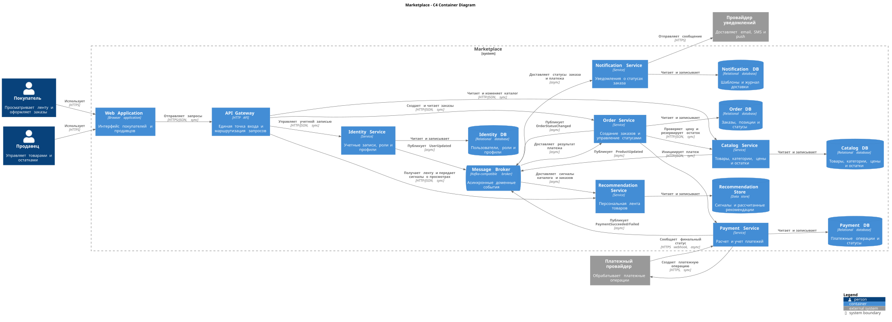

# Домашняя работа 1: архитектура маркетплейса

## 1. Домены и зоны ответственности

| Домен | Ответственность |
|---|---|
| Пользователи | Учетные записи, роли покупателя и продавца, профиль и настройки |
| Каталог | Карточки товаров, категории, цены и доступный остаток |
| Рекомендации | Сбор пользовательских сигналов, построение и выдача персональной ленты |
| Заказы | Корзина заказа, состав заказа, жизненный цикл и статусы |
| Платежи | Расчет суммы, создание платежа, учет результата и возвратов |
| Уведомления | Формирование и отправка сообщений об изменениях статуса заказа |

## 2. Распределение доменов по сервисам

| Домен | Сервис | Логика размещения |
|---|---|---|
| Пользователи | Identity Service | Учетные записи, роли и профили образуют отдельную область ответственности и используются остальными сервисами только через стабильный контракт |
| Каталог | Catalog Service | Товары, категории, цены и остатки изменяются совместно и принадлежат одному бизнес-контексту |
| Рекомендации | Recommendation Service | Формирование ленты имеет отдельный профиль нагрузки, использует асинхронные сигналы и допускает eventual consistency |
| Заказы | Order Service | Состав заказа и смена его статусов образуют единый жизненный цикл, который должен контролироваться одним сервисом |
| Платежи | Payment Service | Платежные операции и их статусы требуют изоляции, повышенной безопасности и отдельной интеграции с платежным провайдером |
| Уведомления | Notification Service | Отправка email, SMS и push выполняется независимо и не должна блокировать оформление заказа или проведение платежа |

Такое разбиение следует бизнес-возможностям маркетплейса: внутри каждого сервиса сохраняется высокая связность логики, а зависимости между сервисами ограничиваются API-контрактами и доменными событиями.

## 3. Варианты декомпозиции

### Вариант A: крупный Marketplace Core

Контейнер `Marketplace Core` объединяет пользователей, каталог и заказы. Рекомендации, платежи и уведомления вынесены отдельно.

Плюсы:

- меньше сетевых вызовов и контрактов;
- проще локальная разработка, тестирование и развертывание;
- проще обеспечить транзакционность каталога и заказа;
- ниже инфраструктурные затраты на старте.

Минусы:

- каталог, пользователи и заказы нельзя масштабировать независимо;
- изменения разных бизнес-областей требуют общего релиза;
- со временем Core может стать крупным и сложным;
- разным командам сложнее независимо развивать свои домены.

### Вариант B: сервисы по бизнес-доменам

Пользователи, каталог, рекомендации, заказы, платежи и уведомления являются самостоятельными сервисами со своими хранилищами.

Плюсы:

- четкие границы ответственности и владения данными;
- независимое развертывание и масштабирование доменов;
- изоляция платежных данных;
- сбой уведомлений не блокирует заказ;
- рекомендации можно масштабировать независимо от транзакционного контура.

Минусы:

- больше сетевых взаимодействий и API-контрактов;
- сложнее наблюдаемость, тестирование и эксплуатация;
- требуется брокер сообщений;
- появляются eventual consistency и обработка повторных событий;
- выше инфраструктурная стоимость.

## 4. Trade-offs и финальный выбор

| Критерий | Вариант A: Marketplace Core | Вариант B: доменные сервисы |
|---|---|---|
| Сложность запуска | Низкая | Выше |
| Независимые релизы | Ограничены | Поддерживаются |
| Масштабирование ленты и каталога | Вместе с Core | Независимое |
| Изоляция платежей | Поддерживается | Поддерживается |
| Связанность доменов | Выше | Ниже при стабильных контрактах |
| Консистентность | Проще | Требует событий и компенсаций |
| Стоимость эксплуатации | Ниже | Выше |

Выбран **вариант B**: каталог и рекомендации масштабируются независимо от заказов и платежей, платежные данные изолированы, а уведомления не блокируют оформление заказа. Цена решения - более сложная эксплуатация и eventual consistency. Синхронные вызовы используются для немедленного ответа пользователю, вторичные реакции передаются через брокер сообщений.

## 5. Финальные сервисы и владение данными

| Сервис | Ответственность | Собственные данные |
|---|---|---|
| Identity Service | Регистрация, аутентификация, роли и профили | Учетные записи, роли, профили, настройки |
| Catalog Service | Управление и чтение каталога | Товары, категории, цены, остатки |
| Recommendation Service | Формирование персональной ленты | История взаимодействий, признаки и рассчитанные рекомендации |
| Order Service | Создание заказа и управление статусами | Заказы, позиции заказа, история статусов |
| Payment Service | Расчет и учет платежей | Платежные операции, суммы, статусы и идентификаторы провайдера |
| Notification Service | Отправка уведомлений | Шаблоны, предпочтения каналов, журнал доставки |

У сервисов нет общей базы данных. Ссылки на сущности других доменов хранятся как идентификаторы, а необходимые изменения передаются через API или события.

## 6. Взаимодействия

| Источник | Получатель | Способ | Назначение |
|---|---|---|---|
| Web Application | API Gateway | Синхронно, HTTPS | Пользовательские запросы |
| API Gateway | Identity Service | Синхронно, HTTP/JSON | Вход и управление профилем |
| API Gateway | Catalog Service | Синхронно, HTTP/JSON | Каталог и операции продавца |
| API Gateway | Recommendation Service | Синхронно, HTTP/JSON | Получение ленты и передача сигналов о просмотрах |
| API Gateway | Order Service | Синхронно, HTTP/JSON | Создание и просмотр заказа |
| Order Service | Catalog Service | Синхронно, HTTP/JSON | Проверка цены и резервирование остатка |
| Order Service | Payment Service | Синхронно, HTTP/JSON | Инициация платежа |
| Payment Service | Payment Provider | Синхронно, HTTPS | Создание операции у внешнего провайдера |
| Payment Provider | Payment Service | Асинхронно, HTTPS webhook | Передача финального статуса платежа |
| Доменные сервисы | Message Broker | Асинхронно, события | Публикация фактов об изменениях |
| Message Broker | Recommendation Service | Асинхронно | Просмотры, изменения каталога, завершенные заказы |
| Message Broker | Notification Service | Асинхронно | Статусы заказа и платежа |
| Message Broker | Order Service | Асинхронно | Финальный результат платежа |
| Notification Service | Notification Provider | Синхронно, HTTPS после получения события | Email, SMS или push |

Для событий должны использоваться уникальные идентификаторы. Потребители обрабатывают события идемпотентно, поскольку брокер может доставить сообщение повторно.

## 7. C4 Container diagram



- Готовая диаграмма: [`marketplace-container.svg`](./marketplace-container.svg).
- Редактируемый исходник: [`marketplace-container.puml`](./marketplace-container.puml).

## 8. Запуск технического сервиса

Из папки `homework-01-marketplace-architecture`:

```bash
docker compose up --build
```

### Проверка

```bash
curl -i http://localhost:8080/health
```

Ожидаемый результат:

```text
HTTP/1.1 200 OK
Content-Type: application/json; charset=utf-8

{"service":"marketplace-health-service","status":"ok"}
```

Остановка Docker Compose:

```bash
docker compose down
```
